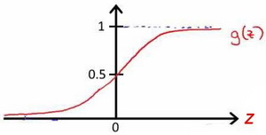
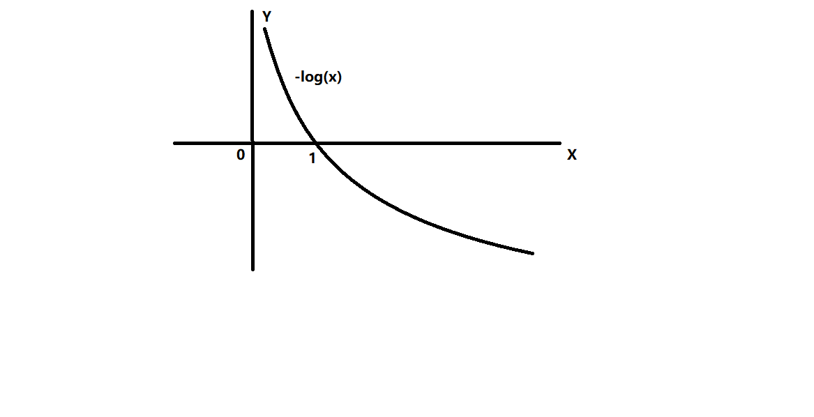

# 整理一下线性回归和逻辑回归：

本周对线性回归和逻辑回归的公式和推导方法进行了整理。

[TOC]

以下使用的字母含义为：

$\theta_{j}$代表函数中的第$j$个参数

$m$ 代表训练集中实例的数量

$x$  代表特征/输入变量

$h$代表函数

$y$ 代表目标变量/输出变量

$\left( x,y \right)$ 代表训练集中的实例

$({{x}^{(i)}},{{y}^{(i)}})$ 代表第$i$ 个观察实例

$n$ 代表特征的数量

${x^{\left( i \right)}}$代表第 $i$ 个训练实例，是特征矩阵中的第$i$行，是一个**向量**（**vector**）。

## 1.线性回归:

线性回归模型是利用线性函数，通过对数据集进行学习，不断优化参数，从而实现一个能对输入数据进行运算并且给出较为准确的预测结果的模型

#### 1.1单元线性回归：

单元线性回归只含有一个特征/输入变量，公式如下：

$h_\theta \left( x \right)=\theta_{0} + \theta_{1}x$

#### 1.2多元线性回归：

多元线性回归在单元线性回归的基础上增加了输入变量的个数，公式如下，计算时常用numpy的dot函数对$X$和$\theta^{T}$进行向量点乘,$X$为整个训练集.

$h_{\theta}\left( x \right)=\theta^{T}X={\theta_{0}}+{\theta_{1}}{x_{1}}+{\theta_{2}}{x_{2}}+...+{\theta_{n}}{x_{n}}$ 

#### 1.3线性回归代价函数：

代价函数用的是常见的平方差公式：

$J\left( \theta  \right)=\frac{1}{2m}\sum\limits_{i=1}^{m}{{{\left( {h_{\theta}}\left( {x^{(i)}} \right)-{y^{(i)}} \right)}^{2}}}$

#### 1.4线性回归梯度下降：

梯度下降公式如下，通过$J\left( \theta  \right)$对$\theta $求导算出梯度，然后不断更新参数$\theta $的值，使得$J\left( \theta  \right)$按梯度下降最快方向进行，一直迭代下去，最终得到局部最小值。其中$a$是学习率（**learning rate**），它决定了我们沿着能让代价函数下降程度最大的方向向下迈出的步子有多大。

${\theta_{j}}:={\theta_{j}}-\alpha \frac{\partial }{\partial {\theta_{j}}}J\left(\theta \right)$

对于每个参数，关键在于求出代价函数的导数，公式如下：

$\frac{\partial }{\partial {{\theta }_{j}}}J({\theta_{0}},{\theta_{1}}...{\theta_{n}} )=\frac{\partial }{\partial {{\theta }_{j}}}\frac{1}{2m}{{\sum\limits_{i=1}^{m}{\left( {{h}_{\theta }}({{x}^{(i)}})-{{y}^{(i)}} \right)}}^{2}}$

故参数更新可按照以下公式进行：

前面说过，$h_{\theta}\left( x \right)=\theta^{T}X={\theta_{0}}+{\theta_{1}}{x_{1}}+{\theta_{2}}{x_{2}}+...+{\theta_{n}}{x_{n}}$ ，故对每个$\theta $求导时，需要进行复合求导，乘上对应的一行${x^{(i)}}$

${{\theta }_{0}}:={{\theta }_{0}}-a\frac{1}{m}\sum\limits_{i=1}^{m}{({{h}_{\theta }}({{x}^{(i)}})-{{y}^{(i)}})}x_{0}^{(i)}$

${{\theta }_{1}}:={{\theta }_{1}}-a\frac{1}{m}\sum\limits_{i=1}^{m}{({{h}_{\theta }}({{x}^{(i)}})-{{y}^{(i)}})}x_{1}^{(i)}$

${{\theta }_{2}}:={{\theta }_{2}}-a\frac{1}{m}\sum\limits_{i=1}^{m}{({{h}_{\theta }}({{x}^{(i)}})-{{y}^{(i)}})}x_{2}^{(i)}$

...

${{\theta }_{n}}:={{\theta }_{n}}-a\frac{1}{m}\sum\limits_{i=1}^{m}{({{h}_{\theta }}({{x}^{(i)}})-{{y}^{(i)}})}x_{n}^{(i)}$

## 2.逻辑回归：

逻辑回归模型是为了解决分类问题而产生的，对于分类， $y$ 取值为 0 或者1，但如果使用的是线性回归，算法得到的值可能会远大于1或者远小于0。所以我们需要使它的输出值永远在0到 1 之间。

以下给出逻辑回归的公式：

${h_\theta}( {x}^{\left( i \right)})=\frac{1}{1+{{e}^{-z}}}$

其中$z=\theta^{T}X=\theta^{T}X={\theta_{0}}+{\theta_{1}}{x_{1}}+{\theta_{2}}{x_{2}}+...+{\theta_{n}}{x_{n}}$ 

该函数图片如下图所示，$z$取任何值都能保证输出值的范围为(0,1)

#### 2.1逻辑回归代价函数：

逻辑回归的代价函数为：$J\left( \theta  \right)=\frac{1}{m}\sum\limits_{i=1}^{m}{{Cost}\left( {h_\theta}\left( {x}^{\left( i \right)} \right),{y}^{\left( i \right)} \right)}$，其中

$$ {{Cost}\left( {h_\theta}\left( {x}^{\left( i \right)} \right),{y} \right)} = \begin{cases} -\log({h_\theta}( {x}^{\left( i \right)} )), & \text{if } y^{\left( i \right)}=1\\ -\log(1-{h_\theta}( {x}^{\left( i \right)} )), & \text{if } y^{\left( i \right)}=0 \end{cases} $$

$-\log(x)$图像如下图所示：

$\text{if } y^{\left( i \right)}=1$,当${h_\theta}( {x}^{\left( i \right)})$预测值越接近1时，$-\log({h_\theta}( {x}^{\left( i \right)}))$值越小，即代价越小;

$\text{if } y^{\left( i \right)}=0$,当${h_\theta}( {x}^{\left( i \right)})$预测值越接近0时，$-\log({1-h_\theta}( {x} ^{\left( i \right)}))$值越小，即代价越小;

这样便实现了模型预测的值越趋向于正确值，所花费的代价越小。

将构建的 $Cost\left( {h_\theta}\left( x^{\left( i \right)} \right),y^{\left( i \right)} \right)$简化如下： 
$Cost\left( {h_\theta}\left( x^{\left( i \right)} \right),y^{\left( i \right)} \right)=-y^{\left( i \right)}\times log\left( {h_\theta}\left( x^{\left( i \right)} \right) \right)-(1-y^{\left( i \right)})\times log\left( 1-{h_\theta}\left( x^{\left( i \right)} \right) \right)$

带入代价函数得到：
$J\left( \theta  \right)=\frac{1}{m}\sum\limits_{i=1}^{m}{[-{{y}^{(i)}}\log \left( {h_\theta}\left( {{x}^{(i)}} \right) \right)-\left( 1-{{y}^{(i)}} \right)\log \left( 1-{h_\theta}\left( {{x}^{(i)}} \right) \right)]}$
即：$J\left( \theta  \right)=-\frac{1}{m}\sum\limits_{i=1}^{m}{[{{y}^{(i)}}\log \left( {h_\theta}\left( {{x}^{(i)}} \right) \right)+\left( 1-{{y}^{(i)}} \right)\log \left( 1-{h_\theta}\left( {{x}^{(i)}} \right) \right)]}$

#### 2.2逻辑回归梯度下降：

循环梯度下降总体公式依然为：

**Repeat** {
$\theta_j := \theta_j - \alpha \frac{\partial}{\partial\theta_j} J(\theta)$
(**simultaneously update all** )
}

推导过程：

$J\left( \theta  \right)=-\frac{1}{m}\sum\limits_{i=1}^{m}{[{{y}^{(i)}}\log \left( {h_\theta}\left( {{x}^{(i)}} \right) \right)+\left( 1-{{y}^{(i)}} \right)\log \left( 1-{h_\theta}\left( {{x}^{(i)}} \right) \right)]}$
考虑：
${h_\theta}\left( {{x}^{(i)}} \right)=\frac{1}{1+{{e}^{-{\theta^T}{{x}^{(i)}}}}}$
则：
${{y}^{(i)}}\log \left( {h_\theta}\left( {{x}^{(i)}} \right) \right)+\left( 1-{{y}^{(i)}} \right)\log \left( 1-{h_\theta}\left( {{x}^{(i)}} \right) \right)$
$={{y}^{(i)}}\log \left( \frac{1}{1+{{e}^{-{\theta^T}{{x}^{(i)}}}}} \right)+\left( 1-{{y}^{(i)}} \right)\log \left( 1-\frac{1}{1+{{e}^{-{\theta^T}{{x}^{(i)}}}}} \right)$
$=-{{y}^{(i)}}\log \left( 1+{{e}^{-{\theta^T}{{x}^{(i)}}}} \right)-\left( 1-{{y}^{(i)}} \right)\log \left( 1+{{e}^{{\theta^T}{{x}^{(i)}}}} \right)$

所以：
$\frac{\partial }{\partial {\theta_{j}}}J\left( \theta  \right)=\frac{\partial }{\partial {\theta_{j}}}[-\frac{1}{m}\sum\limits_{i=1}^{m}{[-{{y}^{(i)}}\log \left( 1+{{e}^{-{\theta^{T}}{{x}^{(i)}}}} \right)-\left( 1-{{y}^{(i)}} \right)\log \left( 1+{{e}^{{\theta^{T}}{{x}^{(i)}}}} \right)]}]$
$=-\frac{1}{m}\sum\limits_{i=1}^{m}{[-{{y}^{(i)}}\frac{-x_{j}^{(i)}{{e}^{-{\theta^{T}}{{x}^{(i)}}}}}{1+{{e}^{-{\theta^{T}}{{x}^{(i)}}}}}-\left( 1-{{y}^{(i)}} \right)\frac{x_j^{(i)}{{e}^{{\theta^T}{{x}^{(i)}}}}}{1+{{e}^{{\theta^T}{{x}^{(i)}}}}}}]$
$=-\frac{1}{m}\sum\limits_{i=1}^{m}{{y}^{(i)}}\frac{x_j^{(i)}}{1+{{e}^{{\theta^T}{{x}^{(i)}}}}}-\left( 1-{{y}^{(i)}} \right)\frac{x_j^{(i)}{{e}^{{\theta^T}{{x}^{(i)}}}}}{1+{{e}^{{\theta^T}{{x}^{(i)}}}}}]$
$=-\frac{1}{m}\sum\limits_{i=1}^{m}{\frac{{{y}^{(i)}}x_j^{(i)}-x_j^{(i)}{{e}^{{\theta^T}{{x}^{(i)}}}}+{{y}^{(i)}}x_j^{(i)}{{e}^{{\theta^T}{{x}^{(i)}}}}}{1+{{e}^{{\theta^T}{{x}^{(i)}}}}}}$
$=-\frac{1}{m}\sum\limits_{i=1}^{m}{\frac{{{y}^{(i)}}\left( 1\text{+}{{e}^{{\theta^T}{{x}^{(i)}}}} \right)-{{e}^{{\theta^T}{{x}^{(i)}}}}}{1+{{e}^{{\theta^T}{{x}^{(i)}}}}}x_j^{(i)}}$
$=-\frac{1}{m}\sum\limits_{i=1}^{m}{({{y}^{(i)}}-\frac{{{e}^{{\theta^T}{{x}^{(i)}}}}}{1+{{e}^{{\theta^T}{{x}^{(i)}}}}})x_j^{(i)}}$
$=-\frac{1}{m}\sum\limits_{i=1}^{m}{({{y}^{(i)}}-\frac{1}{1+{{e}^{-{\theta^T}{{x}^{(i)}}}}})x_j^{(i)}}$
$=-\frac{1}{m}\sum\limits_{i=1}^{m}{[{{y}^{(i)}}-{h_\theta}\left( {{x}^{(i)}} \right)]x_j^{(i)}}$
$=\frac{1}{m}\sum\limits_{i=1}^{m}{[{h_\theta}\left( {{x}^{(i)}} \right)-{{y}^{(i)}}]x_j^{(i)}}$

**虽然得到的梯度下降算法表面上看上去与线性回归的梯度下降算法一样，但是这里的${h_\theta}\left( x^{(i)} \right)=\frac{1}{1+{{e}^{-{\theta^T}{{x}^{(i)}}}}} $与线性回归中不同，所以实际上是不一样的。**