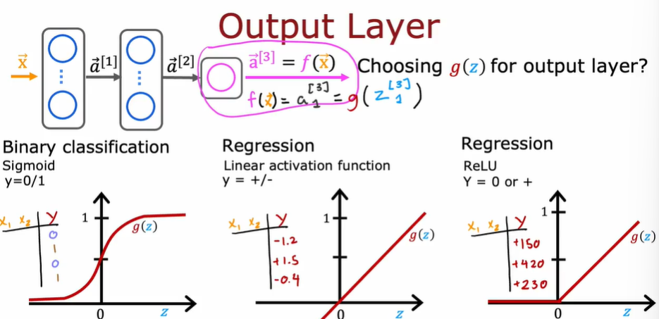

本周学习了Machine learning第二课第二周的内容，并简单使用了tensorflow提供的API模拟了神经网络的训练过程。

##### 神经网络模型训练细节：

神经网络的训练步骤与逻辑回归模型类似，可分为三个步骤：

1.建立神经网络模型计算输出结果

2.定义成本函数

3.使用反向传播算法减少误差

#### 交叉熵损失函数

**交叉熵在分类问题中常常与softmax是标配，softmax将输出的结果进行处理，使其多个分类的预测值和为1，**

**训练集的正确值y用one-hot编码处理**

**再通过交叉熵来计算损失。**

$J = -ylog(f(x)) - (1-y)log(1-f(x))$ 

$-lnx$图像如图：

当y为0时，预测值为1，损失则由-(1-y)log(1-f(x))计算，达到最大

同样的，当y为1，预测值为0时，损失由-ylog(f(x))计算，达到最大

##### 神经网络主流的三种激活函数：

- 二元分类问题-**Sigmoid**
- 回归问题-**Linear activation functions**线性激活函数
- 非负回归问题-**ReLU**

##### 多分类问题

在实际应用情景中，物品属于多个类别，只有0/1两种预测值的逻辑回归模型不足以将物品区分为多个类别。

于是我们使用softmax模型来解决多分类问题：

**embelish**-美化（泛化，推广）

我们在输出层使用softmax模型，可以得到输入的$X$属于数字0-9的概率。

**特有属性，要把所有的z计算出来才可以算a。**

##### Adam梯度下降优化算法

