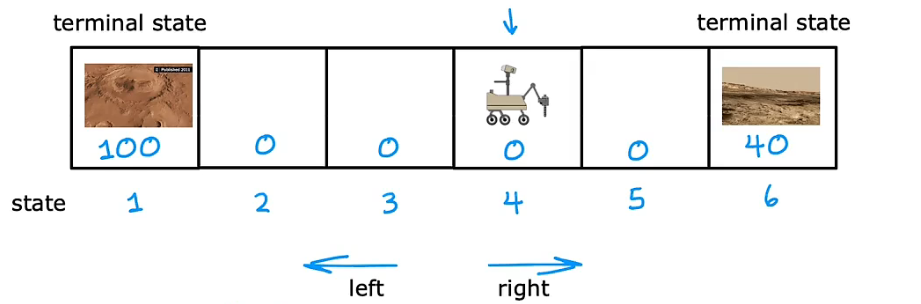
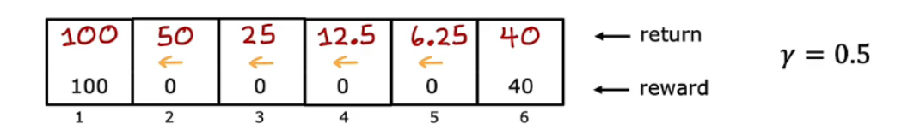
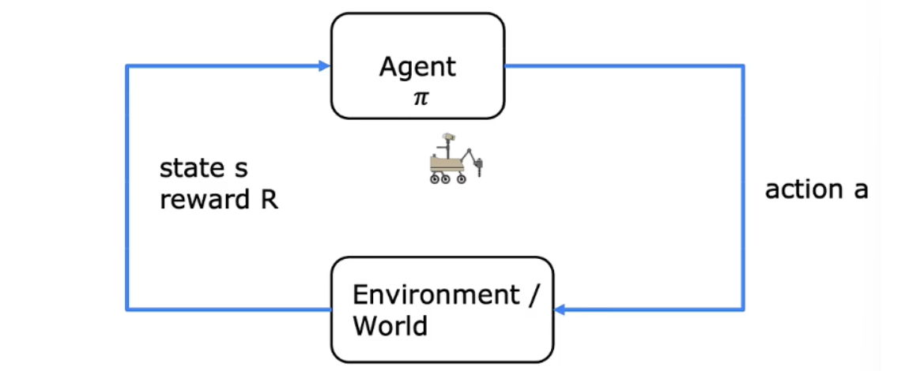
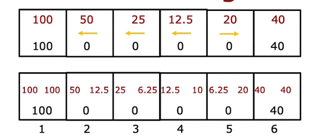
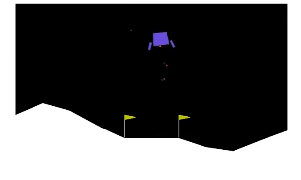
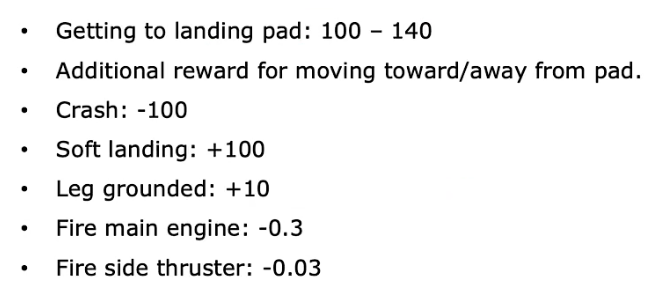
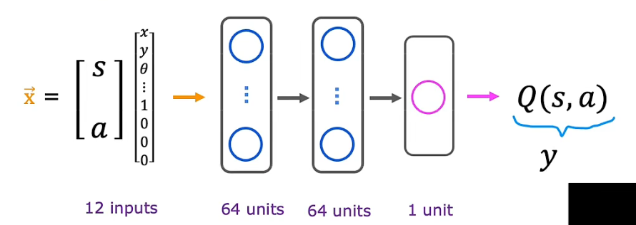
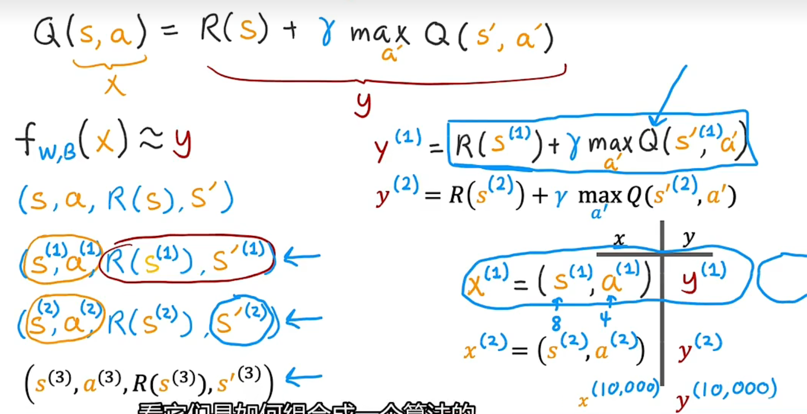
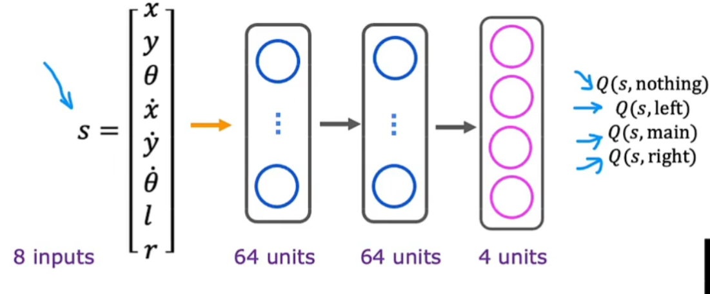

本周（2023.7.10-7.16）学习了机器学习第三课最后一周的内容：强化学习。

* [强化学习](#强化学习)
  * [离散状态空间\-以探测机器人为例](#离散状态空间-以探测机器人为例)
    * [策略函数](#策略函数)
    * [<strong>马尔可夫决策过程</strong>MDP](#马尔可夫决策过程mdp)
    * [状态动作价值函数（Q\-function）](#状态动作价值函数q-function)
    * [贝尔曼方程](#贝尔曼方程)
  * [连续状态空间\-以登月器为例](#连续状态空间-以登月器为例)
    * [状态值函数](#状态值函数)
    * [算法改进：改进的神经网络架构](#算法改进改进的神经网络架构)

# 强化学习

**强化学习可以类比为训练小狗的过程**。当我们训练狗的时候，我们不能像监督学习那样给出正确的行为和对应的标签，让小狗进行学习。因为小狗在学习过程中需要通过与环境的交互来自己探索和学习。因此，在小狗的日常行为中，如果它做了一些正确的事，咱们可以奖励它、夸奖它；相反，如果它干了一些坏事比如在家随地大小便，咱们需要适当的惩罚它让它知道这种行为是错误的。所以，我们需要教狗狗该做什么，而不是如何去做。

因此，强化学习更加关注的是如何将行为与环境的反馈联系起来，以便小狗可以在不断试错的过程中学习到最佳行为策略。在强化学习中，我们需要做的只是定义一个**奖励函数**，然后告诉模型什么时候做的好，什么时候做的不好，算法的工作是自动找出好的动作。

## 离散状态空间-以探测机器人为例

离散状态空间是指状态空间中的状态是离散的，即状态空间由有限或可数个离散的状态组成。例如，在棋盘游戏中，每个状态可以表示为棋子在棋盘上的位置和颜色等属性的组合。在这种情况下，状态空间是有限的，因为棋盘的大小是有限的，每个格子的颜色也是有限的，所以状态空间也是有限的。

**一个简单的例子：**

图中是一个火星机器人，假设有六个状态，状态1和状态6是科学家们想要机器人去探测的区域，分别设置了奖励为100和40，机器人只能选择往左或者往右移动。

从状态4开始，有以下机器人可获得奖励的移动序列：

- $奖励为100:4 \to 3 \to 2 \to 1$ 
- $奖励为40:4 \to 5 \to 6$ 
- $奖励为140:4 \to 5 \to 6 \to 5 \to 4 \to 3 \to 2 \to 1 $ 

可以看到，最后一个序列虽然奖励为140，但是显然花费了更长的时间，所以，**如何判别一组序列比另一组序列更好或更差呢？**

咱们可以设置一个**折扣因子**，**用于模拟得到奖励所需要花费的代价**。

假设折扣因子是0.9，那么对于上述移动序列：

- $奖励 = 0 + 0.9 \times 0 + 0.9^2 \times 0 + 0.9^3 \times 100 = 72.9$
- $奖励 = 0 + 0.9 \times 0 + 0.9^2 \times 40  = 32.4$
- $奖励 = 0 + 0.9 \times 0 + 0.9^2 \times 40 + 0.9^3 \times 0 + 0.9^4 \times 0 + 0.9^5 \times 0 + 0.9^6 \times 0 + 0.9^7 \times 100= 80.23$

因此，咱们可以根据折扣因子计算出从**不同状态**出发，**不同方向**移动的回报，然后选择其中回报最多的序列

如下图，假设折扣因子为0.5，咱们可以计算每个状态出发，然后一直向左走可以得到的回报：

### 策略函数

在强化学习中我们需要指定一个策略，以帮助机器人进行选择，以下举几个简单的例子：

- **追求最多的奖励：**选出在当前状态下可以获得最多奖励的动作

- **追求更大的奖励：**向奖励值最大的方向移动

### **马尔可夫决策过程**MDP

 MDP核心思想就是**下一步的State只和当前的状态State以及当前状态将要采取的Action有关，只回溯一步**。未来只取决于你现在在哪，与过程无关。

机器人或Agent使用某种策略选择一个action，然后世界和环境中会发生某些事情，接着查看得到什么奖励和当前状态。

为什么我们要先定义好整个训练过程符合MDP了，因为只有符合MDP，我们才方便根据当前的State，以及要采取的Action，推理出下一步的State。方便在训练过程中清晰地推理出每一步的State变更，如果在训练过程中我们连每一步的State变化都推理不出，那么也无从训练。

 接下来我们使用强化学习来指导Agent如何行动了。   

### 状态动作价值函数（Q-function）

定义符号$Q(s,a)$表示在状态s，进行动作a得到的结果。

Q-learning是强化学习中的一种 values-based 算法，机器人会不断试错，类似于深度优先搜索的过程，记录下奖励值和对应的路径，**最终是会学习出一个表格 Q-Table**。

咱们继续使用之前火星机器人的例子，折扣因子设为0.5,策略为**追求最多的奖励**。

这个表格的每一行代表每个 state，每一列代表每个 action，表格的数值就是在各个 state 下采取各个 action 时能够获得的**最大的未来期望奖励。**

Action：                                              $ \longleftarrow $                                                                                                                          $ \longrightarrow $

| **1** | $Q（1，\leftarrow）= 100$                                    | $Q（1，\rightarrow）= 100 + 0 = 100$                         |
| :---: | :----------------------------------------------------------- | :----------------------------------------------------------- |
| **2** | $Q（2，\leftarrow）= 0.5 * 100 = 50$                         | $Q（2，\rightarrow）= 0 + 0.5*0 + 0.5^2 * 0 + 0.5^3 * 100 = 12.5$ |
| **3** | $Q（3，\leftarrow）= 0.5^2 * 100 = 25$                       | $Q（3，\rightarrow）= 0 + 0.5*0 + 0.5^2 * 0 + 0.5^3 * 0 + 0.5^4 * 100 = 6.25$ |
| **4** | $Q（4，\leftarrow）=0+ 0.5 * 0 + 0.5^2 * 0 +  0.5^3 * 100 = 12.5$ | $Q（4，\rightarrow）= 0 + 0.5*0 + 0.5^2*40 = 10$             |
| **5** | $Q（5，\leftarrow）= 0 + 0.5*0+0.5^2*0 + 0.5^3 *0+0.5^4* 100 = 6.25$ | $Q（5，\rightarrow）= 0 + 0.5*40 = 20$                       |
| **6** | $Q（6，\leftarrow）= 40 + 0*0.5 = 40$                        | $Q（6，\rightarrow）= 40$                                    |

通过Q函数计算出来的结果如下图，图中箭头是机器人位于每个状态时，遵循策略应该做出的移动方向，选择其中的最大值进行移动。

### 贝尔曼方程

定义符号如下：

$Q(s,a)$ 表示在状态 $s$ 采取动作 $a$ 的值函数，

$s'$ 表示采取动作 $a$ 后的下一个状态，

$R(s)$ 表示在当前状态 $s$ 时获得的奖励，

$\gamma$ 是折扣因子，用于平衡当前奖励和未来奖励的重要性，

$\max_{a'} Q(s',a')$ 表示在下一个状态 $s'$ 时**采取所有可能动作后其中的最大值**，

$$
\huge
Q(s,a) = R(s) + \gamma \max_{a'} Q(s',a')
$$
这个方程的含义是，一个状态动作对的值函数等于在该状态采取该动作后，获得的奖励加上下一个状态所有可能动作的值函数的最大值（乘以折扣因子），再求期望值。这个方程的递归定义可以用动态规划算法来求解，并最终得到所有状态动作对的值函数。除了终端状态是直接等于R(s)。

我们来看一下贝尔曼方程应用在$Q（2，\rightarrow）$上的情况：

$s = 2,a = \rightarrow,s' = 3,a'为\rightarrow或者\leftarrow$

$Q（2，\rightarrow）= R(2)+ 0.5 \times \max_{a'} Q(3,a') = 0 + (0.5)\times25 = 12.5$

$tips:\max_{a'} Q(3,a')=25，因为在状态3时，向左移动得到的奖励为25，向右移动得到的奖励为6.25，取其中较大值$

## 连续状态空间-以登月器为例

连续状态空间是指状态空间中的状态是连续的，即状态空间由无限个连续的状态组成。例如，在机器人控制中，机器人的位置可以表示为连续的坐标值，机器人的速度可以表示为连续的速度值。在这种情况下，状态空间是无限的，因为机器人的位置和速度可以取任意实数值。在自动控制汽车、飞机中，状态s都是连续状态空间，包含x,y,z轴坐标，及各轴方向上速度、角速度等，这都是连续状态空间。

现在我们通过一个登月器的例子来帮助学习状态值函数。假设我们需要指挥正在快速接近月球表面的月球着陆器，我们的工作是在适当的时机使用不同位置的推进器让登月器平稳着陆。

定义状态有8个量：x,y方向位移、速度、倾斜角、角速度、左脚落地l（0/1）、右脚落地r(0/1)

动作有4种：什么都不做、开启左推进器、开启朱推进器、开启右推进器

同时，咱们需要定义一些奖励和惩罚，以激励更多我们想要的行为。

**目标是找到策略函数,当给定一个状态s和动作a时，可以计算出其所能获得的最大的回报**

### 状态值函数

关键思想是训练一个神经网络模型，输入当前状态和动作，计算状态值函数$Q(s,a)$。

我们对四个动作：什么都不做、开启左推进器、开启朱推进器、开启右推进器，进行**one-hot编码**，如果选择什么都不做，则输入值为$[1,0,0,0]^T$。

所以神经网络的输入为8个状态值和4个代表方向的one-hot编码数字。

对每个状态s，使用神经网络分别计算4个动作下的Q，选取Q值最大的动作。

训练神经网络模型的**关键问题**是x,y样本值如何获取（x为s和a，y为Q，主要是y的获取）：把各种状态、各种动作都进行尝试。使用监督学习，进行计算代价、梯度下降等等一系列过程。

输入x是s加上a，共12个数，输出y是由R(s)和s'计算而来，是一个数字。损失函数采用均方误差损失，尝试预测y

- 一开始，随机初始化神经网络，作为Q猜测（有点像在线性回归中，初始化参数，然后使用梯度下降来改进参数）

- 随机采取动作，存储最近的10000个不同s和a的元组信息 s,a,R(s),s'（回放缓冲区），y值计算中的Q最初是利用随机初始化的神经网络进行预测。然后利用这10000组样本数据训练神经网络模型（以x为输入，w b为参数的输出值去近似y），即新的Q预测，再利用新的Q去优化y值，再用于神经网络模型优化，从而不断提高对Q函数的猜测。

### 算法改进：改进的神经网络架构

强化学习的神经网络输入是s,a，输出是回报Q。改进前，一个状态s，要分别计算4次的动作输入值12个，输出值1个。

而改进为神经网络同时输出四个值会更加有效，且更方便选择最大值，可直接用于贝尔曼方程计算：

