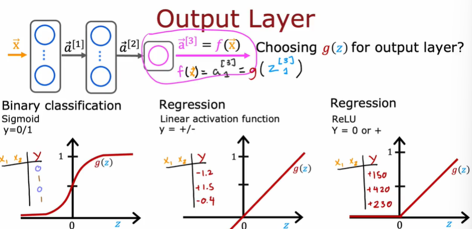

本周学习了Machine learning第二课第二周的内容

###### 首先我们学习了神经网络模型训练细节：

神经网络的训练步骤与逻辑回归模型类似，可分为三个步骤：

1.建立神经网络模型计算输出结果

2.定义成本函数

3.使用反向传播算法减少误差

我简单使用了tensorflow提供的API实现了神经网络的训练过程。

###### 然后学习了神经网络主流的三种激活函数：

- 二元分类问题-**Sigmoid**
- 回归问题-**Linear activation functions**线性激活函数
- 非负回归问题-**ReLU**

