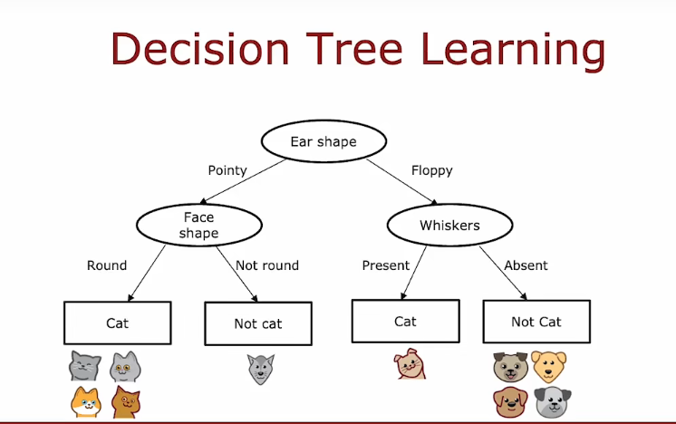
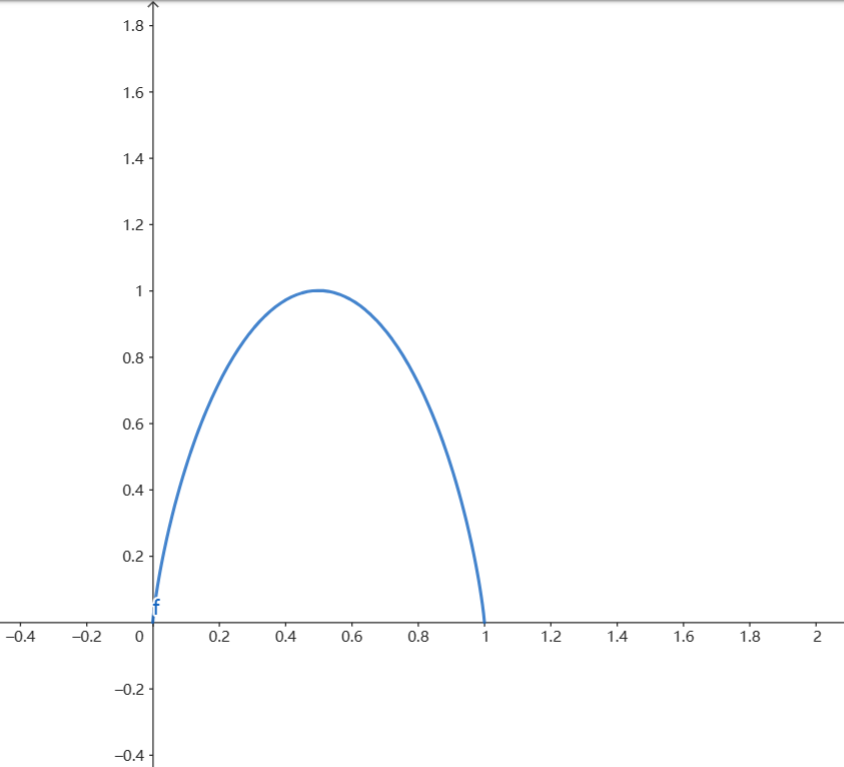
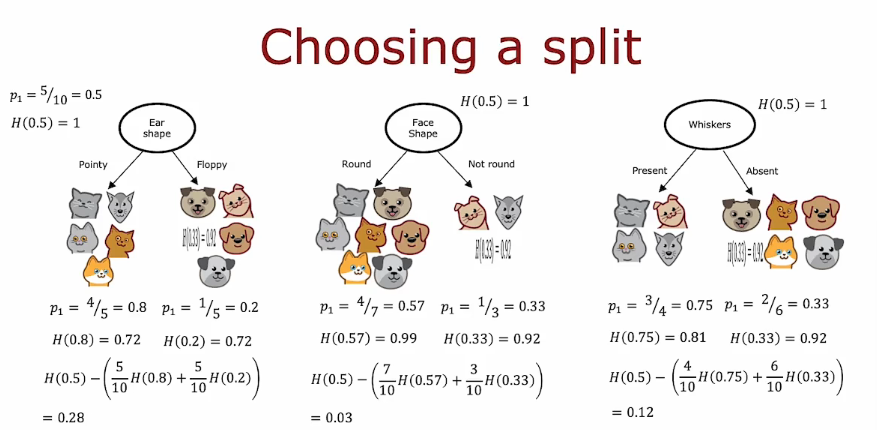
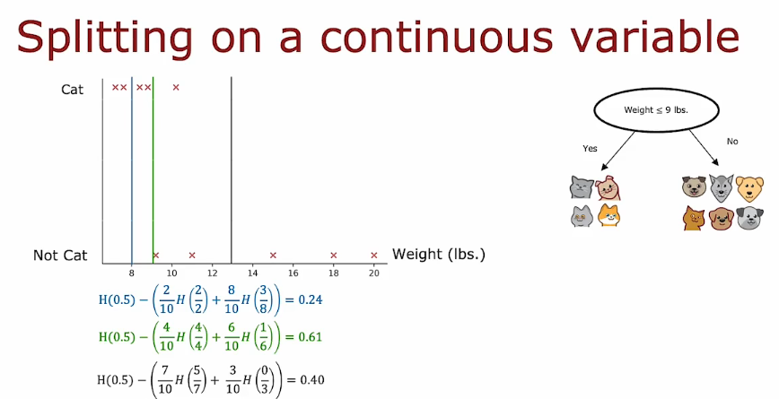
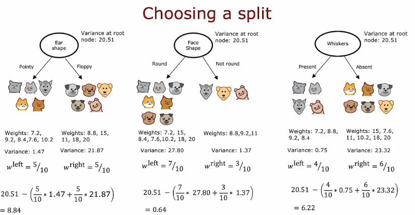
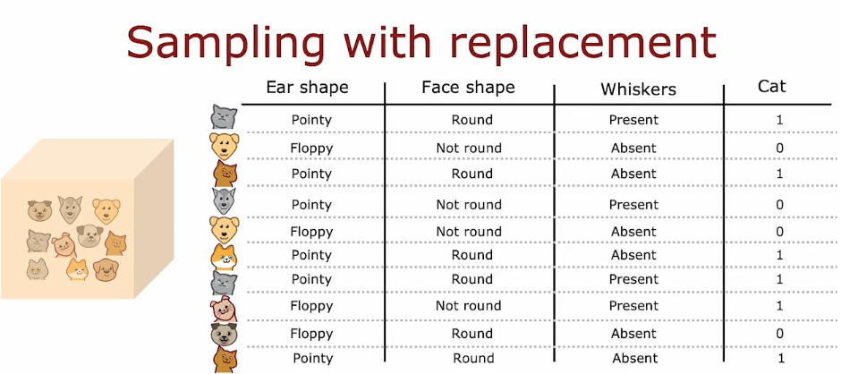

本周学习了第二课第四周决策树的内容

* [决策树模型](#决策树模型)
* [熵的引入](#熵的引入)
* [选择拆分信息增益](#选择拆分信息增益)
* [<strong>One\-Hot Encoding</strong>](#one-hot-encoding)
* [连续型变量](#连续型变量)
* [回归树](#回归树)
* [多决策树（ensembles tree）](#多决策树ensembles-tree)
  * [有放回抽样](#有放回抽样)
* [随机森林](#随机森林)

## 决策树模型

决策树是一种典型的分类方法，包含决策节点和叶子节点，结构类似于二叉排序树，从根节点开始，将样本集按照特征进行分类，然后递归重复此过程。

决策树的学习过程就是由顶端node不断分裂，再通过子节点继续分裂，当样本足够纯的时候，添加一个叶节点，不再继续分裂。

有如下两个**问题**需要考虑：

- **怎么确定先使用哪个特征进行分类？**
- **什么时候停止分类？**

## 熵的引入

Entropy熵：衡量一组数据是否不纯的指标，**值越大，表示样本越不纯。**

举个例子：

假设经过分类后某个分支的样本集数量为六个，

当样本集为六只猫或者六只狗时，我们认为其纯度很高，**即使该分类是cat但是咱们得到的结果是六只狗**。

当样本集为三只猫三只狗时，则认为其纯度最低。

故函数的图像特征应该类似下图：

函数公式：

$p_0 = 1 - p_1$

$H(x)=-p_1log_2(p_1) - p_0log_2(p_0) = -p_1log_2(p_1) - (1-p_1)log_2(1-p_1)$

采用$log_2$函数可以保证$p_1$为0.5时entropy值为1。

## 选择拆分信息增益

熵的减少称为信息增益，由分组带来的不确定性的减少叫做**Information Gain**

$Information Gain = H(p^{root}) - (w_lH(p^{left}) + w_rH(p^{right}))$

$H(p^{root})$代表根节点的熵值

$H(p^{left})$代表左节点的熵值

$H(p^{right})$代表右节点的熵值

$w_l,w_r$分别代表左右节点所占样本比例

即为分裂之前的信息量减去分裂后的加权平均值。（w：左右分支所占的样本比例）

我们比较希望熵越小越好，因为越接近0，他的内容就越纯（全是猫，或全是狗）我们就可以给他添加叶节点了。我们可以看熵的变化-**information gain**，下一层熵的值用加权平均计算，故**Information Gain数值越大越好，数值越大熵下降得越快，纯度越高**。

所以上图中我们优先按照ear shape进行分类。

## **One-Hot Encoding**

如果一个分类特征可以取k个可能的值，我们通过创建k个二进制特征来实现，这些特征只能取值0或1，这种数据处理方法叫One-Hot Encoding。

## 连续型变量

我们已经学习了通过计算不同特征的information gain来优先选择哪个特征进行分类，但是如果咱们需要在一串连续值中选出一个阈值来进行分类，**我们该如何选择最佳的值来进行分类？**

下图是一个是否为猫与动物重量的坐标关系图：

与之前的计算方法一样，我们通过取不同的阈值进行information gain计算，最后得到较高的信息增益，就可以决定在该特征上进行分割。图中会选择重量是否小于等于9来进行分割。

## 回归树

决策树不但可以用来分类（是否是猫），也可以用来回归（预测具体数字y）。

只不过information gain的计算方法从计算entropy变成了计算variance（方差）。

所有样本的方差是20.51，信息增益infomation gain的计算方法为为原始方差减加权方差。**差值越大，方差下降越快，说明你分的越好，与原来分配的更均匀。**

故我们选择ear shape这个特征先分类。

## 多决策树（ensembles tree）

因为树模型对数据的变化很敏感，结果不稳定（在分裂时一个数据变化就可能导致分裂是用的特征不一样），集成多个模型可以解决这个问题。

多决策树模型就是把几个用相同数据训练出来的模型预测出来的结果进行投票，**比如两个模型预测是猫，一个模型预测不是猫，最后结果就是猫。**

### 有放回抽样

有放回抽样就是字面意思，是概率论中的一种抽样方法，我们抽出一个样本记录后将其放回，下次可以继续抽到该样本。

假设我们有十个猫和狗，我们对其进行不放回抽样，虽然其中会有重复的数据，但这样的好处是，我们每次得到的训练集都不一样。

## 随机森林

随机森林通过下面两种方法创造不同模型，然后集成。

- 通过有放回的随机抽取数据
- 通过使用不同特征量。