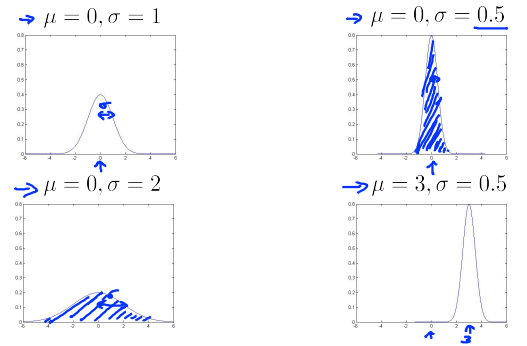

本周学习了第三课第一周的内容
* [K\-means算法](#k-means算法)
  * [优化目标](#优化目标)
  * [随机初始化](#随机初始化)
  * [选择聚类数量](#选择聚类数量)
    * [Elbow method:肘部法则](#elbow-method肘部法则)
* [异常检测算法](#异常检测算法)
  * [Density estimation 密度估算](#density-estimation-密度估算)
  * [高斯正态分布](#高斯正态分布)
  * [参数估计](#参数估计)
  * [异常检测算法（重点）](#异常检测算法重点)
  * [开发和评估一个异常检测算法](#开发和评估一个异常检测算法)

# K-means算法

我们开始学习第一个**无监督学习**算法：**聚类算法**。我们将要让计算机学习无标签数据，而不是此前的标签数据。

我们需要将一系列无标签的训练数据输入到一个算法中，然后让这个算法为我们找到训练数据的内在结构，将无标签数据集分成两个分开的点集（称为簇）。能够划分这些点集的算法，就被称为**聚类算法**。

K-means算法的本质就是：移动中心点，使其渐渐地靠近数据的“中心”，即最小化数据点与中心点的距离。
K-均值算法会做两件事：

- 簇分配
- 移动聚类中心

假设有一个无标签的数据集，想将其分为两个簇，执行K-均值算法。如下图所示：

1. 首先选择 k个随机的点，称为**聚类中心**（**cluster centroids**）；
2. 对于数据集中的每一个数据，按照与k个中心点的距离，将其与距离最近的中心点关联起来，与同一个中心点关联的所有点聚成一类。
3. 计算每一个组的平均值，将该组所关联的中心点移动到平均值的位置。
4. 重复步骤2-4直至中心点不再变化。

## 优化目标

接下来出现的表达式中符号的含义：

$x^{(i)}$表示索引为$i$的点

$c^{(i)}$用来存储与$x^{(i)}$ 距离最近的聚类中心的**索引**

$u_{c^{(i)}}$ 代表与$x^{(i)}$最近的聚类中心点

$u_k$指这个簇中所有点的均值，第k个聚类中心点

k-means的**代价函数**为：

$J(c_1, ..., c_m, \mu_1, ..., \mu_K) = \frac{1}{m}\sum_{i=1}^{m} |x^{(i)} - \mu_{c^{(i)}}|^2$

这是一个计算数据点和中心点距离的平方差的代价函数，由于k-means算法不断地移动中心点，使之与数据点的距离越来越近，故代价函数是保持下降的趋势。

如果在优化过程中，代价函数保持不变或者下降非常缓慢，那么我们可以认为k-means算法已经达到收敛。

## 随机初始化

由于初始化的中心点对于最后的分类结果影响很大，因而很容易出现：当初始化的中心点不同时，其结果可能千差万别：

因此，为了分类结果更加合理，我们可以多次初始化中心点，即多次运行K-means算法，然后取其中$J(c_1, ..., c_m, \mu_1, ..., \mu_K)$最小的分类结果。

## 选择聚类数量

聚类是**无监督**算法，并没有给出正确答案，也无法得知其中到底有多少个簇。

那么我们如何确定数据点该分成几个聚类呢？（如何选择k的值？）

选择k的值很困难的一个原因在于，通常在数据集中有多少个聚类是不容易区分的。下图所示的例子中，有的人可能会看到两个聚类，有的人会看到四个聚类。

### Elbow method:肘部法则

假设随着k的增大，$J$的大小呈现以下的形状，类似于人的手臂，而k=3的位置类似于手臂的肘部

可以看到，当k=3时，J已经很小了，且再增大k也不能大大地减小J。说明此时k选取3比较合适。

但是，这种“手肘”情况并不常见，更一般的情况是：

此时随着k的增加，成本函数$J$会一直下降，这样会导致一直选择最大值的k。

通常人们运行k均值聚类方法时为了得到一些聚类，用于后续操作。也许是用来做市场分割，也许是用来使电脑的聚类变得更好……其中有的会给你一个评估标准。

**通常，更好的方式是决定聚类的数量，来看不同的聚类数值能为后续目的提供多好的结果。**

以T恤尺寸为例，我们尝试决定是否需要3种T恤尺寸。分别算出k=3和k=5的情况，根据实际市场需求决定选取哪种。

# 异常检测算法

**异常检测**(Anomaly detection)问题是机器学习算法的一个**常见应用**。主要用于**非监督学习问题**。

什么是异常检测呢？飞机引擎制造商生产的**飞机引擎**，从生产线上流出时，需要进行QA(质量控制测试)，而作为**这个测试的一部分**，你测量了飞机引擎的一些特征变量，比如，你**可能测量了引擎运转时产生的热量**或者**引擎的振动**等等。这样，你就有了一个**数据集从$x_1$到$x_m$**，如果你生产了m个引擎的话，也许你会将这些**数据绘制成图表**，看起来就是这个样子，这里的每个点、每个叉都是你的**无标签数据**。

异常检测可定义如下：

假设得到一个新的飞机引擎从生产线上做出，其特征为$x_{test}$，我们希望知道这个新的飞机引擎是否有某种异常。

## Density estimation 密度估算

有数据集${x_1,x_2...x_m}$，如何判断$x_{test}$是否异常？

对给定的训练集，对数据建立一个模型$p(x)$，即对特征变量$x$的分布概率建模，接下来对新的特征变量进行检验，其中$\epsilon$为阈值：

1. 若$p(x_{test}) < \epsilon$，则将其标记为异常。
2. 若$p(x_{test}) > \epsilon$，则将其标记为正常。

**总结：**在中心区域的点有很大的概率是正常的，离中心稍微远一点的点概率会小一些，更远的地方的点概率将会更小，再远的将成为异常点。

## 高斯正态分布

常见的概率分布函数。

**公式：**

$f(x) = \frac{1}{\sigma \sqrt{2\pi}} e^{-\frac{(x - \mu)^2}{2\sigma^2}}$

高斯分布的概率密度函数描述了随机变量在不同取值下出现的概率分布，具有钟形曲线的形状。

均值 $\mu$ 决定了曲线的中心位置，标准差 $\sigma$ 决定了曲线的宽度。

## 参数估计

什么是参数估计问题？

有${x_1,x_2...x_m}$个样本，它们都是实数，在下图中标记出了整个数据集，图中的横轴是x轴，其取值分布广泛。猜测这些样本来自一个高斯分布的总体，每一个样本$x_i$服从高斯分布，即$x_i$~$N(\mu,\sigma^2)$，但不知道具体的$\mu$和$\sigma^2$的值。

参数估计问题就是给定数据集，估算出$\mu$和$\sigma^2$的值。根据$x_i$的分布情况画出蓝色的曲线如图所示。

计算$\mu$和$\sigma$的**标准公式：**

$\mu=\frac{1}{n}\sum_{i=1}^{n}x_i$

$\sigma=\sqrt{\frac{1}{n}\sum_{i=1}^{n}(x_i-\mu)^2}$

## 异常检测算法（重点）

机器学习中常用的一种异常检测算法是基于高斯分布模型的算法。该算法假设正常数据的分布符合高斯分布，即正态分布，而异常数据则偏离正常数据的分布，不符合高斯分布模型。因此，该算法可以通过计算样本数据点的概率密度来判断其是否为异常数据。

**Training set（训练集）: ${x^{(1)},x^{(2)},...x^{(n)}}$**

**$x^{(i)}$代表第$i$个特征的数据集，有n维数据点。**

以下是基于高斯分布模型的异常检测算法的步骤：

1. 假设数据集中的每个特征都符合高斯分布，即正态分布，即使数据本身不符合高斯分布，也可以通过对数据进行变换（如对数变换）来使其符合高斯分布。

2. 对**训练集**中每个特征的数据集$x^{(i)}$计算其均值$\mu_i$和方差$\sigma_i$。

3. 对**测试集**中的每个数据点，计算其在**每个特征**下的概率密度。具体地，对于一个 $n$ 维数据点 $\boldsymbol{x}=(x_1, x_2, \cdots, x_n)$，其在第 $i$ 个特征下的概率密度为：
   $$
   p_i(x_i) = \frac{1}{\sqrt{2\pi\sigma_i^2}}\exp\left(-\frac{(x_i-\mu_i)^2}{2\sigma_i^2}\right)
   $$
   其中，$\mu_i$ 和 $\sigma_i$ 分别是**训练集**中第 $i$ 个特征$x^{(i)}$的均值和标准差，$x_i$代表**测试集**对应第$i$个特征的参数，$p_i(x_i)$是将**测试集**的$x_i$代入在**训练集**中第 $i$ 个特征下的参数方程计算出来的的概率密度。

4. 对于一个 $n$ 维数据点，其在整个数据集下的概率密度为各个特征下概率密度的乘积，即：
   $$
   p(\boldsymbol{x}) = \prod_{i=1}^n p_i(x_i)
   $$

5. 对于一个测试集中的数据点，如果其概率密度$p(\boldsymbol{x})$小于设定的阈值$ \epsilon $，就判定为异常数据。

**以下是一个例子：**

1.两个特征$x^{(1)},$$x^{(2)}$的训练集以及特征的分布情况。

2.三维图表示的密度估计函数，$z$轴为根据两个特征$x^{(1)},x^{(2)}$所估计的$p(\boldsymbol{x})$值。

3.

代入$x^{(1)}_{test}$,$x^{(2)}_{test}$,分别计算两个特征下的概率密度，然后求出在整个数据集下的概率密度$p(\boldsymbol{x})$

设定一个$\epsilon$值，若$p(\boldsymbol{x}) < \epsilon$，则将其标记为异常；若$p(\boldsymbol{x}) > \epsilon$，则将其标记为正常。

## 开发和评估一个异常检测算法

当你尝试为特定应用开发学习算法时，你需要做出很多选择，如选择特征值。假如我们有一种评估学习算法的方法，那么决策将会容易很多。
