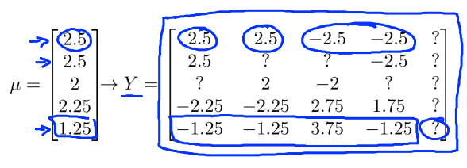

本周学习了机器学习第三课第二周的内容：推荐系统。

* [推荐系统](#推荐系统)
  * [基于内容的推荐系统](#基于内容的推荐系统)
    * [代价函数](#代价函数)
  * [协同过滤算法](#协同过滤算法)
    * [代价函数（注意和推荐系统的代价函数对比）](#代价函数注意和推荐系统的代价函数对比)
    * [均值归一化](#均值归一化)

# 推荐系统

**电影评级预测的样例**：

用户对电影进行评分：用0~5表示其对电影的喜好程度，?表示未看过该电影。

| Movie                | Alice(1) | Bob(2) | Carol(3) | Dave(4) |
| -------------------- | -------- | ------ | -------- | ------- |
| Love at last         | 5        | 5      | 0        | 0       |
| Romance forever      | 5        | ?      | ?        | 0       |
| Cute puppies of love | ?        | 4      | 0        | ?       |
| Nonstop car chases   | 0        | 0      | 5        | 4       |
| Swords vs. karate    | 0        | 0      | 5        | ?       |

定义符号如下：

$n_u$表示用户的数量，此例中用户的数量为4

$n_m$表示项目的数量，此例中电影的数量为5

$r(i,j)$表示用户$i$是否对电影$j$评分，用0/1表示，例如$r(1,1) = 1$ but $r(1,3) = 0$

$y^{(i,j)}$表示用户$i$对电影$j$的评分，例如$y^{(1,1)} = 5$，表示Alice对Love at last这个电影评分为5

## 基于内容的推荐系统

在一个基于内容的推荐系统算法中，我们假设对于我们希望推荐的东西有一些数据，这些数据是有关这些东西的特征。

假设每部电影都有两个**特征**，如$x_1$代表电影的浪漫程度，$x_2$代表电影的动作程度。

则每部电影都有一个特征向量，**定义符号$x^{(i)}$是第$i$部电影的特征向量**，比如第一部电影的特征向量$x^{(1)}$为[0.9，0]，$n$为特征个数。

| Movie                | Alice(1) | Bob(2) | Carol(3) | Dave(4) | $x_1$(romance) | $x_2$(action) |
| -------------------- | -------- | ------ | -------- | ------- | -------------- | ------------- |
| Love at last         | 5        | 5      | 0        | 0       | 0.9            | 0             |
| Romance forever      | 5        | ?      | ?        | 0       | 1.0            | 0.01          |
| Cute puppies of love | ?        | 4      | 0        | ?       | 0.99           | 0             |
| Nonstop car chases   | 0        | 0      | 5        | 4       | 0.1            | 1.0           |
| Swords vs. karate    | 0        | 0      | 5        | ?       | 1              | 0.9           |

假设我们采用线性回归模型，我们可以针对**每一个用户都训练一个线性回归模型**，**$\theta^{(i)}$是第$i$个用户的模型的参数**，**n+1维**，包括**参数**$w^{(i)}$和一个**偏置值**$b^{(i)}$。

那么对于用户$i$和电影$j$，我们预测该用户对电影的评分为：
$$
Y^{(i,j)} = (\theta^{(i)})^T*x^{(j)}
$$
**举个简单的例子**：

从表格中我们得知，Alice更喜欢观看爱情电影，假设Alice的模型参数$\theta^{(1)} = \begin{bmatrix}5\\0\\0\end{bmatrix}$,$x^{(1)} = \begin{bmatrix}0.9\\0\\1\end{bmatrix}$,则可以得知Alice对电影（1） Love at last的评分预测值为$(\theta^{(1)})^T*x^{(1)} = 4.5$。

### 代价函数

对于用户$i$，我们可以计算该用户对电影的实际评分和我们预测评分的代价函数：
$$
J(\theta) = \frac{1}{2m^{(i)}}\sum_{j:r(i,j)=1} (y^{(i,j)} - (\theta^{(i)})^T*x^{(j)})^2 + \frac{\lambda}{2}\sum_{k=1}^{n}(\theta^{(i)}_k)^2
$$
其中:

**$i$为用户索引，$j$为电影索引**

**$j:r(i,j)=1$表示我们只计算那些用户$i$评过分的电影。**

**$m^{(i)}$为该用户评分过的电影数量。**

通过这个代价函数，我们可以计算出该用户对所有电影评分和我们预测评分的代价。

上面的代价函数只是针对一个用户的，为了学习所有用户，我们将所有用户的代价函数求和：
$$
J(\theta) = \frac{1}{2\sum_{i = 1}^{n_u}m^{(i)}}\sum_{i=1}^{n_u}\sum_{j:r(i,j)=1} (y^{(i,j)} - (\theta^{(i)})^T*x^{(j)})^2 + \frac{\lambda}{2}\sum_{i=1}^{n_u}\sum_{k=1}^{n}(\theta^{(i)}_k)^2
$$

然后通过**梯度下降**不断优化参数得到最优解。**假设用户$i$正在寻找感兴趣的电影，我们可以利用系统预测该用户对电影的评分，进而推荐预测评分高的电影**。这样我们就得到了一个可以按照用户偏好内容进行推荐的系统，**但前提是我们需要知道电影的特征向量**。

## 协同过滤算法

在之前的基于内容的推荐系统中，对于每一部电影，我们都掌握了可用的电影特征，使用这些特征训练出了每一个用户的参数。相反地，如果我们拥有用户的参数，我们可以学习得出电影的特征。

| Movie                | Alice(1) | Bob(2) | Carol(3) | Dave(4) | $x_1$(romance) | $x_2$(action) |
| -------------------- | -------- | ------ | -------- | ------- | -------------- | ------------- |
| Love at last         | 5        | 5      | 0        | 0       | ?              | ?             |
| Romance forever      | 5        | ?      | ?        | 0       | ?              | ?             |
| Cute puppies of love | ?        | 4      | 0        | ?       | ?              | ?             |
| Nonstop car chases   | 0        | 0      | 5        | 4       | ?              | ?             |
| Swords vs. karate    | 0        | 0      | 5        | ?       | ?              | ?             |

假设我们不知道电影的特征值$x_1,x_2$,但是我们知道用户的模型参数，假设四个用户的模型参数为：

$\theta^{(1)} = \begin{bmatrix}5\\0\\0\end{bmatrix}$，$\theta^{(2)} = \begin{bmatrix}5\\0\\0\end{bmatrix}$，$\theta^{(3)} = \begin{bmatrix}0\\5\\0\end{bmatrix}$，$\theta^{(4)} = \begin{bmatrix}0\\5\\0\end{bmatrix}$

利用公式$Y^{(i,j)} = (\theta^{(i)})^T*x^{(j)}$和四个用户对第一部电影Love at last的评分，可以反过来得到：
$$
\left\{
\begin{aligned}
(\theta^{(1)})^T*x^{(1)} = 5\\
(\theta^{(2)})^T*x^{(1)} = 5 \\
(\theta^{(3)})^T*x^{(1)} = 0 \\
(\theta^{(4)})^T*x^{(1)} = 0 \\
\end{aligned}
\right.
$$
这样便可以得到特征向量的大概值$x^{(1)} = \begin{bmatrix}1\\0\\1\end{bmatrix}$,依此类推也可以得到$x^{(2)},x^{(3)},x^{(4)},x^{(5)}$。

因为咱们有一部电影的多个用户评分，所以可以提取出特征向量的大概值。

### 代价函数（注意和推荐系统的代价函数对比）

对于咱们通过**协同过滤算法**得到的电影$i$的特征向量$x^{(i)}$，我们可以计算**使用提取出来的特征向量预测的评分**和**真实值**的代价函数：
$$
J(x^{(i)}) = \frac{1}{2u^{(i)}}\sum_{j:r(i,j)=1} (y^{(i,j)} - (\theta^{(j)})^T*x^{(i)})^2 +\frac{\lambda}{2} \sum_{k=1}^{n}(x^{(i)}_k)^2
$$
其中:

**$i$为电影索引，$j$为用户索引**

**$j:r(i,j)=1$表示我们只计算为电影$i$评分过的用户**

**$u^{(i)}$为电影$i$评分过的用户数量。**

对所有电影的代价函数进行求和：
$$
J(x^{(i)}) = \frac{1}{2\sum_{i = 1}^{n_m}u^{(i)}}\sum_{i=1}^{n_m}\sum_{j:r(i,j)=1} (y^{(i,j)} - (\theta^{(j)})^T*x^{(i)})^2 + \frac{\lambda}{2} \sum_{i=1}^{n_m}\sum_{k=1}^{n}(x^{(i)}_k)^2
$$
然后进行梯度下降，同样可以得到一个可以按照用户偏好内容进行推荐的系统，**但前提是我们需要知道用户的模型参数**。

将上面的两个优化目标合为一个：
$$
J(x^{(i)},\theta^{(i)}) = \frac{1}{2}\sum_{j:r(i,j)=1} (y^{(i,j)} - (\theta^{(j)})^T*x^{(i)})^2+\frac{\lambda}{2} \sum_{i=1}^{n_m}\sum_{k=1}^{n}(x^{(i)}_k)^2 + \frac{\lambda}{2}\sum_{j=1}^{n_u}\sum_{k=1}^{n}(\theta^{(j)}_k)^2
$$
**如果我们能知道$\theta$就能学习得到$x$，如果我们知道$x$也会学习出$\theta$来。通过随机初始化参数，建立代价函数，梯度下降，然后不停迭代，最终会收敛到一组合理的电影的特征和一组对不同用户参数的合理估计。**

### 均值归一化

| Movie                | Alice(1) | Bob(2) | Carol(3) | Dave(4) | Eve(5) |
| -------------------- | -------- | ------ | -------- | ------- | ------ |
| Love at last         | 5        | 5      | 0        | 0       | ?      |
| Romance forever      | 5        | ?      | ?        | 0       | ?      |
| Cute puppies of love | ?        | 4      | 0        | ?       | ?      |
| Nonstop car chases   | 0        | 0      | 5        | 4       | ?      |
| Swords vs. karate    | 0        | 0      | 5        | ?       | ?      |

假设有一组数据，即**有一个用户Eve未对电影进行任何评价**。这时候如果我们使用之前的方法测Eve对每部电影的评分，则最小化图上的公式，因为对于任意电影$j$，Eve都没有评分过，**因此公式中$j:r(i,j)=1$条件不满足**，相关部分对于最小化Eve的数据没有作用，因此对于最小化Eve数据有作用的便只有$\frac{\lambda}{2}\sum_{k=1}^{n}(\theta^{(i)}_k)^2$部分。因两者都为0，故$(\theta^{(5)})^T*x^{(j)} = 0$，**于是Eve的电影预测评分都为0**。

虽然结果是得出来了，但是这个结果我们没办法用来推荐。

所以我们对电影的评分进行均值归一化。

我们将表格中的电影评分转换为矩阵$Y$:
$$
\mathbf{Y} = \begin{bmatrix} 
5 & 5 & 0 & 0 &  ? \\ 
5 & ? & ? & 0 &  ? \\ 
? & 4 & 0 & ? &  ? \\ 
0 & 0 & 5 & 4 &  ? \\ 
0 & 0 & 5 & ? &  ? 
\end{bmatrix}
$$
对于某一部电影，利用已经评过分的值（？不计算在内），计算出平均分，记为$\mu$，于是归一化矩阵为原来的$Y$的每一个数减去这一行（这一部电影）对应的平均值，得到新的矩阵$Y$。

归一化之后的预测值公式为：$(\theta^{(5)})^T*x^{(j)} + \mu = \mu = \mathbf{\mu} = \begin{bmatrix} 
2.5\\
2.5\\
2\\
2.25\\
1.25
\end{bmatrix}$

**因为我们不知道Eve的喜好，因此把她的评分预测为平均水平。**

**另一种情况**：若出现有**一部电影**无评分的情况，则可以**计算每列的均值**，**用Y减去对应列的均值得到新的Y矩阵**。
